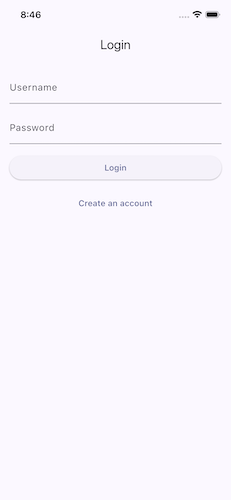
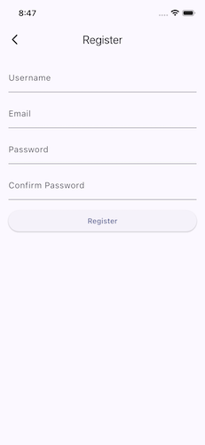
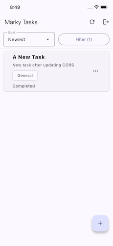
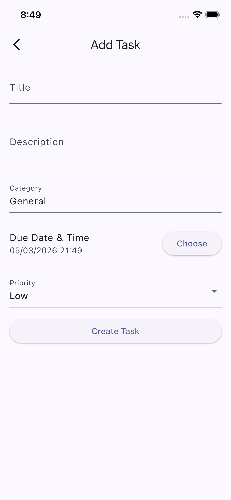
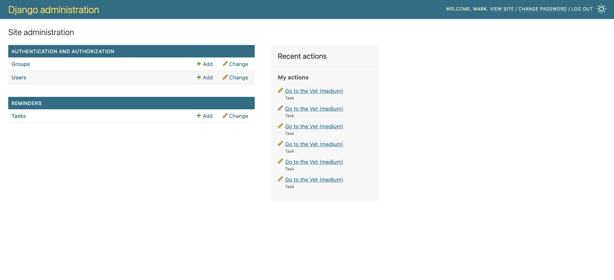

# Task Reminder App

A cross-platform task management application built with **Flutter** and a **Django REST API**. The app allows users to create, organize, prioritize, and manage reminders while supporting automatic task-priority escalation over time.

This project was created for a Software Engineering course as a full-stack mobile application demonstrating user authentication, CRUD functionality, backend API integration, persistent storage, and administrative system management.

---

## Table of Contents

- [Project Overview](#project-overview)
- [Key Features](#key-features)
- [Demo](#demo)
- [Screenshots](#screenshots)
- [Tech Stack](#tech-stack)
- [System Architecture](#system-architecture)
- [User Roles](#user-roles)
- [Functional Requirements](#functional-requirements)
- [Non-Functional Requirements](#non-functional-requirements)
- [Repository Structure](#repository-structure)
- [Getting Started](#getting-started)
- [Flutter Frontend Setup](#flutter-frontend-setup)
- [Django Backend Setup](#django-backend-setup)
- [Environment Variables](#environment-variables)
- [API Overview](#api-overview)
- [Priority Escalation Logic](#priority-escalation-logic)
- [Admin Features](#admin-features)
- [Testing](#testing)
- [Known Limitations](#known-limitations)
- [Future Improvements](#future-improvements)
- [Team Members](#team-members)

---

## Project Overview

The **Task Reminder App** helps users manage personal tasks and reminders by allowing them to create tasks with due dates, categories, and priority levels. Tasks can be viewed, edited, completed, deleted, and sorted based on urgency or category.

A major requirement of the project is automatic task priority escalation. If a task remains incomplete, the backend periodically increases its urgency by adjusting the priority level. This ensures that older or neglected tasks become more visible to the user over time.

The system includes a Flutter frontend, a Django REST Framework backend, JWT-based authentication, and a MariaDB/MySQL database.

---

## Key Features

### User Features

- Create a new account
- Log in securely using JWT authentication
- Create new reminder tasks
- View a list of saved tasks
- Edit existing tasks
- Delete tasks
- Mark tasks as complete
- Assign task categories
- Assign priority levels from 1 to 5
- View tasks sorted by priority, due date, or category
- Automatically receive updated priority values when tasks age

### Backend Features

- Django REST API
- User registration and login endpoints
- Token-based authentication using JSON Web Tokens
- Task CRUD operations
- MariaDB/MySQL database integration
- Server-side priority escalation logic
- Django admin dashboard for system management

### Admin Features

- View registered users
- View all stored tasks
- Inspect task ownership, priority, due date, and completion status
- Add, edit, or delete task records from the Django admin panel
- Verify backend data changes after frontend actions

---

## Demo

Final project demo video:

> Add YouTube demo link here.

Repository links:

- Frontend Repository: `Add frontend GitHub repository link here`
- Backend Repository: `Add backend GitHub repository link here`

---

## Screenshots

Add screenshots or GIFs of the app below.

### Login Screen



### Register Screen



### Task List Screen



### Create Task Screen



### Django Admin Dashboard



---

## Tech Stack

### Frontend

- Flutter
- Dart
- HTTP package for API requests
- Flutter Secure Storage for token storage
- Material Design UI components

### Backend

- Python
- Django
- Django REST Framework
- Simple JWT authentication
- Gunicorn
- NGINX

### Database

- MariaDB / MySQL

### Deployment

- VPS-hosted Django backend
- NGINX reverse proxy
- SSL certificate using Let's Encrypt / Certbot
- API subdomain for frontend-backend communication

---

## System Architecture

```text
+----------------------+        HTTPS/API Requests        +----------------------+
|                      |  ----------------------------->  |                      |
|   Flutter Frontend   |                                 |   Django REST API    |
|                      |  <-----------------------------  |                      |
+----------------------+        JSON Responses            +----------+-----------+
                                                                      |
                                                                      |
                                                              Database Queries
                                                                      |
                                                                      v
                                                          +----------------------+
                                                          |                      |
                                                          |   MariaDB / MySQL    |
                                                          |                      |
                                                          +----------------------+
```

The Flutter application communicates with the Django backend through REST API endpoints. The backend handles authentication, task data validation, database operations, and priority escalation. Data is stored persistently in a MariaDB/MySQL database.

---

## User Roles

### Standard User

A standard user can register, log in, and manage their own tasks. Each user only has access to tasks associated with their account.

### Administrator

An administrator can access the Django admin dashboard to manage users and task records. The admin role is primarily used for system monitoring, data verification, and backend management.

---

## Functional Requirements

| ID | Requirement | Status |
|---|---|---|
| FR-01 | Users can create an account | Complete |
| FR-02 | Users can log in securely | Complete |
| FR-03 | Users can create tasks | Complete |
| FR-04 | Users can view tasks | Complete |
| FR-05 | Users can edit tasks | Complete |
| FR-06 | Users can delete tasks | Complete |
| FR-07 | Users can mark tasks as complete | Complete |
| FR-08 | Users can assign categories to tasks | Complete |
| FR-09 | Users can assign task priorities | Complete |
| FR-10 | Tasks automatically escalate priority every four hours | Complete |
| FR-11 | Admin can view users and tasks through Django admin | Complete |

---

## Non-Functional Requirements

| ID | Requirement | Description |
|---|---|---|
| NFR-01 | Usability | The app should provide a simple and intuitive interface for managing reminders. |
| NFR-02 | Security | Authentication is handled using JWT tokens, and protected endpoints require authorization. |
| NFR-03 | Reliability | Tasks are stored in a persistent backend database instead of local-only storage. |
| NFR-04 | Maintainability | The project separates frontend, backend, and database responsibilities. |
| NFR-05 | Scalability | The backend API can be extended with additional task features, notification support, and role-based access. |
| NFR-06 | Portability | Flutter allows the frontend to run across multiple platforms. |

---

## Repository Structure

Update this section to match the final repository layout.

```text
TaskReminder/
├── task_reminder_app/              # Flutter frontend
│   ├── lib/
│   │   ├── main.dart
│   │   ├── screens/
│   │   ├── services/
│   │   ├── models/
│   │   └── widgets/
│   ├── assets/
│   ├── pubspec.yaml
│   └── README.md
│
├── task_reminder_backend/          # Django backend
│   ├── manage.py
│   ├── task_reminder_backend/
│   ├── tasks/
│   ├── staticfiles/
│   ├── requirements.txt
│   └── README.md
│
└── README.md                       # Main project README
```

---

## Getting Started

### Prerequisites

Make sure the following are installed:

- Flutter SDK
- Dart SDK
- Python 3.10 or newer
- pip
- virtualenv or venv
- MySQL or MariaDB
- Git

Optional for deployment:

- NGINX
- Gunicorn
- Certbot
- A VPS or cloud server

---

## Flutter Frontend Setup

1. Clone the repository:

```bash
git clone <repository-url>
cd <repository-folder>
```

2. Navigate to the Flutter app:

```bash
cd task_reminder_app
```

3. Install Flutter dependencies:

```bash
flutter pub get
```

4. Run the app:

```bash
flutter run
```

5. Confirm the API base URL is set correctly in the frontend service file.

Example:

```dart
const String baseUrl = 'https://api.example.com/api';
```

For local development, this may point to a local backend instead:

```dart
const String baseUrl = 'http://127.0.0.1:8000/api';
```

---

## Django Backend Setup

1. Navigate to the backend folder:

```bash
cd task_reminder_backend
```

2. Create and activate a virtual environment:

```bash
python3 -m venv venv
source venv/bin/activate
```

On Windows:

```bash
python -m venv venv
venv\Scripts\activate
```

3. Install dependencies:

```bash
pip install -r requirements.txt
```

4. Create a `.env` file in the backend directory.

5. Run database migrations:

```bash
python manage.py migrate
```

6. Create a superuser for the Django admin dashboard:

```bash
python manage.py createsuperuser
```

7. Start the development server:

```bash
python manage.py runserver
```

---

## Environment Variables

Example `.env` configuration:

```env
SECRET_KEY=your-django-secret-key
DEBUG=True
ALLOWED_HOSTS=127.0.0.1,localhost,api.example.com

DB_NAME=your_database_name
DB_USER=your_database_user
DB_PASSWORD=your_database_password
DB_HOST=your_database_host
DB_PORT=3306

CORS_ALLOWED_ORIGINS=http://localhost:3000,http://127.0.0.1:3000
CSRF_TRUSTED_ORIGINS=https://api.example.com
```

Do not commit real secret keys, database passwords, or production credentials to GitHub.

---

## API Overview

Example API endpoints:

| Method | Endpoint | Description | Auth Required |
|---|---|---|---|
| POST | `/api/register/` | Register a new user | No |
| POST | `/api/token/` | Obtain access and refresh tokens | No |
| POST | `/api/token/refresh/` | Refresh an expired access token | No |
| GET | `/api/tasks/` | Retrieve user tasks | Yes |
| POST | `/api/tasks/` | Create a new task | Yes |
| GET | `/api/tasks/<id>/` | Retrieve a specific task | Yes |
| PUT/PATCH | `/api/tasks/<id>/` | Update a task | Yes |
| DELETE | `/api/tasks/<id>/` | Delete a task | Yes |
```

---

## Priority Escalation Logic

Task priority values range from **1** to **5**, where **1** is the highest priority and **5** is the lowest priority.

The system automatically escalates incomplete tasks every four hours. For example:

```text
Priority 5 → Priority 4 → Priority 3 → Priority 2 → Priority 1
```

Completed tasks should not continue escalating. Tasks that are already at priority 1 remain at priority 1.

The backend handles this process through a Django management command that can be triggered manually or scheduled with a cron job.

Example cron job:

```bash
0 */4 * * * /path/to/venv/bin/python /path/to/backend/manage.py escalate_tasks >> /path/to/backend/escalate_tasks.log 2>&1
```

---

## Admin Features

The Django admin dashboard allows administrators to manage backend data directly.

Admin capabilities include:

- Viewing all users
- Viewing all task records
- Creating new task records
- Editing task details
- Deleting task records
- Confirming that frontend actions are reflected in the database
- Verifying priority escalation results

The admin dashboard is useful during the demo because it clearly shows that frontend actions are being saved to the backend database.

---

## Testing

Testing may include:

- Creating a new user account
- Logging in with valid credentials
- Attempting login with invalid credentials
- Creating a task
- Editing a task
- Deleting a task
- Marking a task complete
- Verifying task persistence after closing and reopening the app
- Confirming API authentication requirements
- Verifying priority escalation through the backend
- Confirming data changes in Django admin

Example manual test case:

| Test Case | Expected Result |
|---|---|
| Register a new user with valid credentials | User account is created successfully |
| Log in with the new account | User is authenticated and taken to the task list |
| Create a task with priority 5 | Task appears in the task list and database |
| Run the priority escalation command | Task priority changes from 5 to 4 if incomplete |
| Mark a task as complete | Task no longer escalates |

---

## Known Limitations

- Push notifications may not be fully implemented yet.
- The current priority escalation behavior follows the course requirement but may not be ideal for all real-world reminder workflows.
- Admin features are handled through Django admin rather than a dedicated custom admin screen in Flutter.
- Some deployment configuration may vary depending on the environment.

---

## Future Improvements

Potential improvements include:

- Push notifications for due tasks
- Notifications when a task priority escalates
- A dedicated Flutter admin dashboard
- More advanced task filtering and search
- Recurring reminders
- Calendar integration
- Task sharing between users
- Better analytics for completed and overdue tasks
- Dark mode support
- Improved UI animations and transitions

---

## Team Members

Add team member names here:

- Mark Hendricks
- Anafiel Marie Abad
- Sunwoo Lee
- Diego Ugaz
- Sebastian Barrera

---

## License

This project was created for academic purposes. Add a license if the repository will be publicly maintained.

